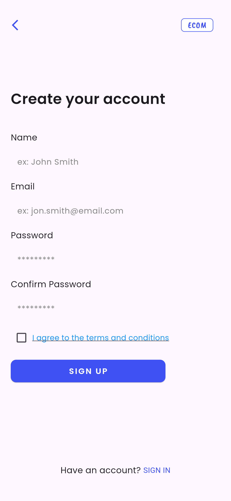
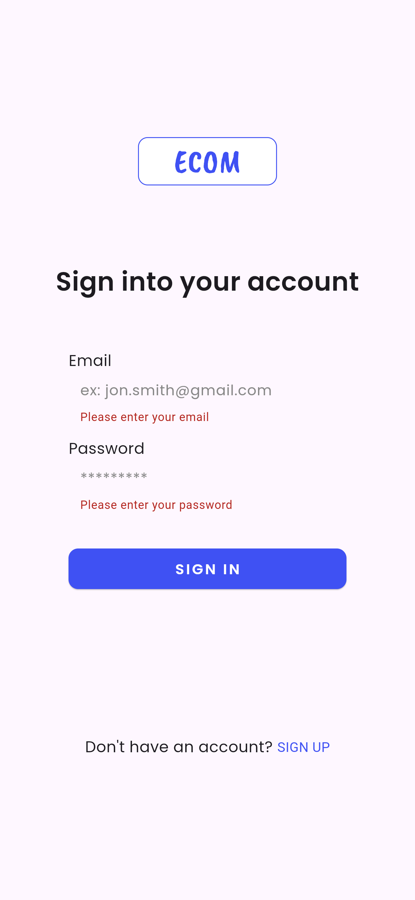
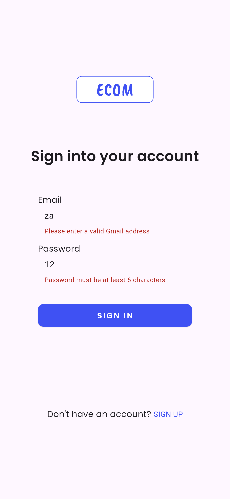

# eCommerce Flutter App

A Flutter eCommerce app demonstrating user authentication (Sign In, Sign Up) with Bloc state management, form validation, and navigation.

## Features

* **Sign In** and **Sign Up** pages with validation
* Bloc-based authentication management
* Immediate navigation to Home page on sign-up button press
* Error feedback on failed login/sign-up via snack bars
* Clean UI using Google Fonts
* Navigation routes: Splash, Sign In, Sign Up, Home
* Form validation including email format, password rules, and password confirmation

## Sample 
### Sign In Screen







### Sign Up Screen


### Splash Screen


## Project Structure

```
lib/
├── features/
│   └── authentication/
│       ├── domain/
│       ├── data/
│       ├── presentation/
│       │   ├── bloc/
│       │   ├── pages/
│       │   │   ├── screen/
│       │   │   |    ├── home_screen.dart
│       │   │   |    └── splash_screen.dart
│       │   │   ├── sign_in_page.dart
│       │   │   ├── sign_up_page.dart
│       │   └── widgets/
│       │       ├── sign_in_form.dart
│       │       └── sign_up_form.dart
├── core/
│   └── usecases/
|── injection_container.dart
└── main.dart
```

## How It Works

1. **App Start**
   Splash screen triggers an authentication check. If user is authenticated, navigate to Home; else Sign In.

2. **Sign In**
   User enters email and password. Bloc validates and attempts login. On success, navigates to Home; on failure, shows error message.

3. **Sign Up**
   User enters name, email, password, confirms password, and accepts terms. On pressing Sign Up button, immediately navigates to Home (you can change this to wait for actual sign-up confirmation if needed).

4. **Navigation**
   Routes configured for splash, sign-in, sign-up, and home pages.

## Getting Started

### Prerequisites

* Flutter SDK (2.10 or above recommended)
* Dart
* Android/iOS emulator or physical device

### Installation

```bash
git clone https://github.com/your_username/ecommerce_flutter_app.git
cd ecommerce_flutter_app
flutter pub get
flutter run
```

## Usage

* Launch app → Splash screen
* Navigate to Sign In or Sign Up pages
* Enter credentials and sign in/up
* On successful auth, app navigates to Home screen

## Notes

* Authentication state managed with Bloc and events like `SignInEvent`, `SignUpEvent`, `AppStarted`.
* Form fields include validation: email format, password length, password confirmation.
* You can modify navigation logic as per your needs (e.g., navigate only after authentication success).
* Currently, Sign Up button immediately navigates to Home for demo purposes.

## Dependencies

* flutter\_bloc
* equatable
* google\_fonts


